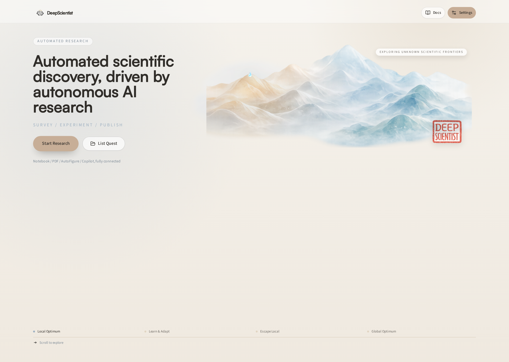
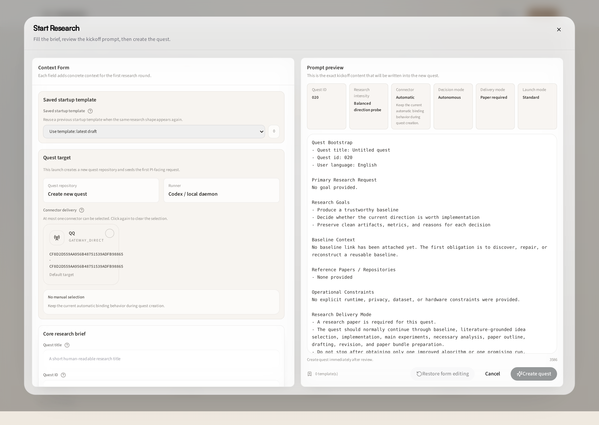
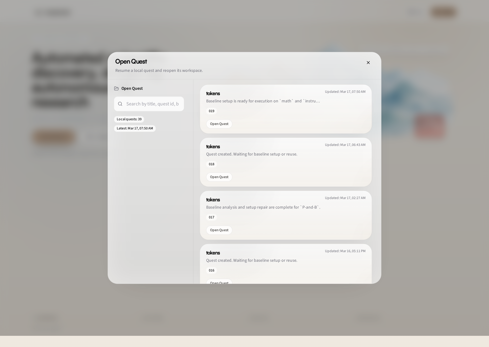

# 00 Quick Start: Launch DeepScientist and Run Your First Project

This is the fastest way to go from installation to a running project.

You will do four things:

1. install DeepScientist
2. start the local runtime
3. create a new project from the home page
4. reopen old projects from the project list

The screenshots in this guide use the current live web UI at `deepscientist.cc:20999` as an example. Your local UI at `127.0.0.1:20999` should look the same or very close.

## 1. Install

Install `uv`, then install Codex and DeepScientist globally:

```bash
curl -LsSf https://astral.sh/uv/install.sh | sh
```

```bash
npm install -g @openai/codex @researai/deepscientist
```

If you plan to compile LaTeX locally later, you can also install the lightweight PDF runtime:

```bash
ds latex install-runtime
```

## 2. Start DeepScientist

Start the local daemon and web workspace:

```bash
ds
```

DeepScientist now uses `uv` to manage a locked local Python runtime. If a conda environment is active and already provides Python `>=3.11`, `ds` will prefer that environment automatically. Otherwise `uv` will provision a managed Python under the DeepScientist home.

By default, the DeepScientist home is `~/DeepScientist` on macOS and Linux, and `%USERPROFILE%\\DeepScientist` on Windows. You can override it with `ds --home <path>`.

By default, the web UI is served at:

```text
http://127.0.0.1:20999
```

If the browser does not open automatically, paste that address into your browser manually.

If you want another port:

```bash
ds --port 21000
```

If you want the web UI to bind on all interfaces:

```bash
ds --host 0.0.0.0 --port 21000
```

## 3. Understand the Home Page

When DeepScientist starts, open the home page at `/`.



The home page is intentionally simple. The two main entry buttons are:

- `Start Research`: create a new project and launch a new research run
- `Open Project`: reopen an existing project

If you are using DeepScientist for the first time, start with `Start Research`.

## 4. Create a New Project With Start Research

Click `Start Research` to open the launch dialog.



This dialog creates a new project repository and writes the startup contract for the agent.

The most important fields are:

- `Project ID`: usually auto-generated in sequence such as `00`, `01`, `02`
- `Primary request` / research goal: the actual scientific task you want the agent to work on
- `Reuse Baseline`: optional; choose an existing baseline if you want to continue from an earlier result
- `Research intensity`: how aggressive the run should be
- `Decision mode`: `Autonomous` means the agent should keep going by itself unless a true approval is needed
- `Research paper`: choose whether the run should also aim to produce paper-style output
- `Language`: choose the user-facing language for the run

For a first test, keep it simple:

- write one clear research question
- leave baseline empty unless you already have one
- use `Balanced` or `Sprint`
- keep decision mode on `Autonomous`

Then click the final `Start Research` action in the dialog.

## 5. Reopen an Existing Project With Open Project

Click `Open Project` on the home page to open the existing project list.



Use this dialog when you want to:

- reopen a project that is already running or already finished
- search by project title or project id
- jump back into a previous workspace quickly

Each row corresponds to one project repository. Click a project card to open it.

## 6. What Happens After Opening a Project

After you create or open a project, DeepScientist takes you to the workspace page for that project.

Inside the workspace, the usual flow is:

1. watch agent progress in Copilot / Studio
2. inspect files, notes, and generated artifacts
3. use Canvas to understand the current project graph and stage progress
4. stop the run only when you intentionally want to interrupt it

## 7. Useful Runtime Commands

Check status:

```bash
ds --status
```

Stop the current local daemon:

```bash
ds --stop
```

Run diagnostics if something looks broken:

```bash
ds doctor
```

## 8. What To Read Next

- [01 Settings Reference: Configure DeepScientist](./01_SETTINGS_REFERENCE.md)
- [02 Start Research Guide: Fill the Start Research Contract](./02_START_RESEARCH_GUIDE.md)
- [03 QQ Connector Guide: Use QQ With DeepScientist](./03_QQ_CONNECTOR_GUIDE.md)
- [05 TUI Guide: Use the Terminal Interface](./05_TUI_GUIDE.md)
